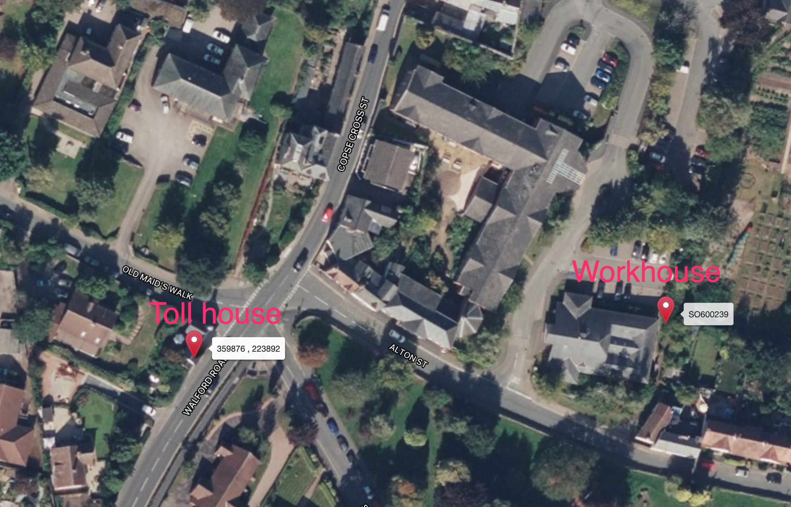

# Interlude — The Sin-Eater of Ross

Far from being introduced as a *Welsh* tradition, Aubrey's description of the sin-eater, which underpins much of the "legend", actually describes an individual in Ross-on-Wye, just over the border in the English county of *Herefordshire* rather than Welsh county of *Monmouthshire*.

> In the county of Hereford was an old custom at funerals to hire poor people, who were to take upon them the sins of the party deceased. One of them (he was a long, lean, ugly, lamentable poor rascal), I remember, lived in a cottage on Rosse highway. The manner was that when the corpse was brought out of the house, and laid on the bier, a loaf of bread was brought out, and delivered to the Sin-eater, over the corpse, as also a mazard bowl of maple, full of beer (which he was to drink up), and sixpence in money, in consideration whereof he took upon him, *ipso facto*, all the sins of the defunct, and freed him or her from walking after they were dead. `e.g. Hone's Year-Book, 1832, pp.858-9`

The original manuscript is available as part of Lansdowne MS 231/3, dated 1568-1637 — although the commentary by Aubrey ("Mr. Gwin, the minister [of Llanggors], about 1640") is later — sets the time at which this _"long, lean, ugly, lamentable poor rascal"_ lived as the first half of the 17th century or even earlier.

Local legend today still has it that the sin-eater's house was near the old cross-roads at the top of the evocatively named *Corpse-Cross Street*. If you visit Ross today, on the main road leading up the hill out of the market square is *Copse Cross Street*. The name itself perhaps hints at a standing cross that once stood there, albeit with one of the branches at the crossroads being a small branch road to the adjacent churchyard.

Correspondence in the Ross Gazette of [Thursday, 26th October, 1911, p3](https://www.britishnewspaperarchive.co.uk/viewer/bl/0002068/19111026/092/0003) suggests that this, in fact, a relatively recent name.

> STREET NOMENCLATURE
>
> CORRESPONDENCE.
>
> To the Editor of the Ross Gazette.
>
> Sir,—In a recent issue of your paper, the Revising Barrister is reported to have said when examining the voters' lists for Ross, that he much preferred the old name of Corpse-Cross-street to the new one of Copse-Cross-street.
>
> The change, if I remember rightly, was made about ten years ago, and at the same time Dockstreet was altered to Wye-street.
>
> For my own part, I have always held the opinion that in both cases the change was greatly to be deplored. "Corpse-Cross" is, I understand, Corpus Christi, and "Dock" is reminiscent of the days when the river was used as a means of communication for trading purposes. I believe the reason given at the time for the alteration was that "Corpse" was a very unpleasant word, and that "Dock" might lead visitors to think that those who lived in that street belonged to the criminal classes.
>
> Our Urban Council have recently been dealing with the question of street nomenclature. Will they "take occasion by the hand," and restore their ancient names to these two thoroughfares?
> Yours &c.,
> THETA.
> 17th October, 1911.

The old name of Dock Street suggests this road led down to the river, as well as out along the river to Wilton Bridge. My understanding of the Corpus Christi reference was that this is a misnomer, althogh there was a procession on that festival date *[I forget where I read that!]*.

According to the [`ross-on-wye.com`](http://ross-on-wye.com/index.php?page=ross_510-Alton_Street&pg=1) website, _"[t]he names 'Alton Street' and 'Alton Road' come from 'Old Town Street' and 'Old Town Road'" Furthermore and these were the original main roads into and out of the town in the middle ages."_

Looking closely at a town map of Ross, we see that walking up the hill from the market house along Copse Cross Street, or perhaps, *Corpse*-Cross street, leads to a crossroads with Old Maid's Walk to the right, (leading to the Church, and then back down Church Street), Walford-road continuing straight up the hill, and Old Town Street (Alton Street), to the left. Alton Street itself then changes direction and becomes Alton Road, leading up to what is now (new) Gloucester Road and back up to the market square.



Another feature of old Ross were the almshouses on Church Street, [described](http://ross-on-wye.com/index.php?page=ross_070-Almshouses&pg=1) by `ross-on-wye.com` in the following terms:

> The Tudor-fronted Rudhall almshouses in Church Street are still inhabited. These were founded in the fourteenth century and rebuilt in 1575. They were restored relatively recently in 1960, by the Ross Charity Trustees and at this time the five original houses were changed into three larger houses without changing the fronts. These Almshouses are probably some of the oldest buildings left in Ross with parts of the Church probably being the oldest.
>
> There are records of people who were not wealthy leaving money for the upkeep of the almshouses showing their importance within the community. For example, an Alice Spencer, who was just a servant at Rudhall, left money to the Rudhall almshouses in 1677.

A postcard is also described with the following inscription:

> THIS Hospital, of very ancient foundation, appears to have been purchased by one of the Rudhale family together with a rent-charge of four groats per annum issuing out of the Church Orchard or Orleton's Court (Alton Court) Farm; and in 1755 it was repaired by William Rudhale of Rudhale, and vested in his heirs for poor persons of Ross.

"Orleton's Court" perhaps offers an alternative derivation of "Alton" than "Old Town"?

It perhaps also worth noting that *[t]he current Market Hall was built between 1650 and 1654, replacing an older probably wooden building*, suggesting there was a Market Hall already in place at the time Aubrey was writing, and the one we see today was built shortly after and would have been a familiar site even at the end of he 17th century.

Looking at a larger map of the area suggests the major roads that crossed at Ross-on-Wye went out to Hereford (NNW), via Wilton and Pengethly; Ledbury (NW), via Much Marcle; Goodrich (SSW), and on to Monmouth via a route south of the river, via Walford; and Gloucester (SE), via Weston-under-Penyard.

A strip map shows the four major routes out of town.


From a map published by John Cary in 1790, we clearly see the routes out of Ross, including two routes out of Ross to Monmouth, one on either side of the river.


The road to Walford is also show as passing through *Ham Green* (Hom Green), presumably following the route of what is Archenfield Road today.

In the greater scheme of things, the layout of the roads meeting at Ross suggests we might regard the town itself as a cross-roads, with the junction of Old Town Street, and the original road to Gloucester via Weston-under-Penyard, Cross-Corpse Street down to the market place, and Walford Road towards Walford as *one part* of "a cross-roads at Ross" (it doesn't seem to make sense the Old Maid's Walk was a major throughfare, although it did lead to the Church and Church Lane), and the market-place itself, with roads leading out towards Ledbury and, via Dock Street, to the Wilton Bridge and west towards Goodrich and Monmouth, as well as northwestwards to Hereford, as the other? Alton Street, and then Alton Road, themselves, were perhaps the main road into town.

According to the [`ross-on-wye.com`](http://www.ross-on-wye.com/index.php?page=ross_510-Gloucester_Road&pg=1) website, the "new" Gloucester Road wasn't built until 1825. Indeed, an [1823 street map of Ross](https://fosmross.org.uk/1823-map/) by Thomas Wakeman clearly shows just the location of what is now known as *Old Gloucester Road*, a little way up Corps Cross Street from the marketplace. We also note that today's Church Street was named *Lower Church Lane* at that time.


The `ross-on-wye.com` website further documents the history of the town's important buildings and features, as well as each of the roads in Ross. For example, we learn that Wilton Bridge, a red sandstone structure built between 1597 to 1599 out of red sandstone, replaced an earlier wooden bridge across the original ford in the Wye that was there. The description further [suggests](https://www.ross-on-wye.com/index.php?page=ross_605-Wilton_Bridge&pg=1) that there was no *stone* bridge over the river Wye between Hereford and Monmouth, citing Leland's *Itinerary* (I'm not sure which volume?) as follows: "[t]here is now a Bridge beneath Hereford on Wye, until a little above the Confluence of Wye and Mone River.... there is a Wood Bridge by Rosse." (The Mone river goes through Monmouth). The site also explains the origins of the stone bridge:

> [A]lthough the River Wye was low in the summer, it's source in the mountains meant that in the winter it was a raging torrent the ford was impassable and so during the high water periods a ferry ran across the river.
>
> At one point the ferry sank and as a result of an Act of Parliament in 1597, it was ordered that a stone bridge needed to be built to stop this from happening again. This was funded by imposing a tax on every town and village in Herefordshire except for Hereford city itself.
>
> After it was completed, the rights of pontage (as it was a toll bridge) were granted to Charles Bridges as a reimbursement for his loss of ferry rights.

Near the top of Old Town Street, *(the site that is now the Ross Community Hospital and Alton Street Doctors Surgery),* was the Ross Work House, originally built around 1777 on land bequeathed to the parish of Ross in 1728. This original workhouse was demolished and rebuilt in 1836-7, and again in 1872-3 [[reference](https://www.workhouses.org.uk/Ross/)]. The original workhouse housed up to 100 or so inmates, and its replacement further increased the capacity, at one point housing over 150, male and female, young and old, as well as "idiots", "imbeciles" and the mentally ill. Several songs collected by Cecil Sharp from the workhouse were published in [*The Ross Workhouse Songbook*](https://michaelraven.co.uk/product/the-ross-workhouse-songbook-softcover-book/). In the late 1800s at least, there was also a pub near the top of Alton Street, tied to [Wintles Brewery](https://www.gloucestershirepubs.co.uk/wintles-brewery-mitcheldean/) of Mitcheldean, called the Harp Inn.

By the junction of Cross-Corpse Street / Old Town Street / Walford Road was a toll gate, the Walford Turnpike Gate. A toll house was later erected at the same location — the house on the corner of Old Maids Walk and Walford Road today — by the Ross Turnpike Trust in 1748.

Coltman's map of turnpike roads in William Coxe's [An historical tour in Monmouthshire](https://archive.org/details/b22011730_0001/page/n23/mode/2up?q=ross) of 1801 hints at the turnpike roads out of Ross around the end of the 19th century.


The complete map gives a more detailed view of the road network, including turnpike roads, across Monmouthshire.


A more detailed map of Herefordshire by John Cary in 1790 shows the comprehensive road network in that county.


```{admonition} Turnpikes

The [`turnpikes.org.uk`](http://www.turnpikes.org.uk/The%20Turnpike%20Roads.htm) website provides a specialist history of turnpike roads, a network of well maintained and toll-supported roads developed in the 18th century.

A turnpike was a defensive gate, originally formed from a frame of pikes, that prevented passage unless a toll was paid. Local "Turnpike Trusts" managed roads in their locale, of 20 miles or so in length, by Act of Parliament, in the area around Ross, specifically 12 Geo1 c.13, (Roads, Gloucester to Hereford Act 1725 c. 13) 1725, with various towns, including Ross, taking local control of their roads via the [Hereford Roads Act 1748, c. 26 (22 Geo. II)](https://archive.org/details/statutesatlarge19britgoog/page/n22/mode/2up?q=hereford), [&c.](https://archive.org/details/statutesatlarge19britgoog/page/n336/mode/2up?q=Rofs), to wit: "[f]or repairing and widening the several roads leading into the town of Ross in the county of Hereford. *Certain tolls granted for 21 years.*"

The `ross-on-wye.com` website provides the following [history of toll gates around Ross](http://www.ross-on-wye.com/index.php?page=ross_120-Toll_Gates):

> Prior to 1830, the town boundary was at Brookend Street and there was a tollgate there. Once the town boundaries were changed then the position of the gates changed.
>
> The Ross Turnpike Trust was a powerful organisation in the area. This can be seen as in 1839 in the Ross area there were around twelve Toll Gates under the Control of the Ross Turnpike Roads Trustees. These are thought to have been located at: Wilton, Pencraig, Marsh, Hownhall, Ryeford, Corps-Cross (now Copse Cross), Coughton, Walford, Overross, Gatsford, Coldbrough, Marcle.
>
> Each of these were up for Let by Auction and bidders had to pay £100 pounds upon making their first bid to ensure they had enough money to pay the first months rent in advance. This money was returned to the bidder upon completion of the Auction or used for payment for the advance rent.
>
> One gate was charging 6d (about 2½ pence) to enter or leave Ross per day. Being as it cost about 7s (about 35p) for a return ticket to London, this was quite a high price.
>
> By 1872 when the Ross Highway Board took over control of the roads due to the local Turnpike Trusts being abolished, the toll gates were at: Walford, Wilton, Ledbury Road, Over Ross, Copse Cross Toll Gate.

```

Regarding Copse (Corpse) Cross Street, the [`ross-on-wye.com`](http://www.ross-on-wye.com/index.php?page=ross_510-Copse_Cross_Street) website provides the following information:

> [R]unning south from the point where the High Street meets Old Gloucester Road, [i]t runs up to and becomes Walford Road just after the junction with Old Maids Walk, Alton Street and Sussex Avenue, at the point where the Copse Cross Toll Gate stood.
>
> The name Copse Cross Street is thought to come from Corpse Cross Street. This has two possible derivations for this, one idea is that there was a hang mans cross at this point, or because suicide victims were buried at the cross in a hastily-dug hole without a Priest present. This was a common method of burying suicide victims as they were thought to be "unholy". The act of interring suicides here is thought to have continued here until 1923 when laws was passed to prevent the act.
This second idea ties in to one story about the derivation of Old Maids Walk.

A letter in the Ross Gazette of [Thursday, 5th August, 1875, p4](https://www.britishnewspaperarchive.co.uk/viewer/bl/0002067/18750805/063/0004), also reviews the origins of the name of Corpse-Cross Street.

> CORRESPONDENCE.
> LOCAL NOMENCLATURE.
> To the Editor of the Ross Gazette.
>
> Dear Sir,—In looking over your very nice and improved re-issue of the *Wye Tour*, I see that you quote two derivations of the name, Corpse-Cross-street. It occurs to me that both these are far-fetched, and that the name is properly "Corpse"-Cross, and was given in consequence of a custom of burying suicides at the junction of the four roads. When I was a child in Ross, I was told that persons then living could remember such burials at that place; and I dreaded to go near it at nightfall. I dare my some of my seniors could give interesting particulars if they chose. Why was the road adjacent, leading to the Church, called "The Old Maid's Walk"? The title is suggestive, and there must have been some legend connected with it. "L. E. L." (Miss Landon) did not *reside* in Ross. She used to visit her aunt, who lived the home opposite Claireville House, close to Corpse Cross. I have a dim recollection of seeing her, when I was very little, at her aunt's.
> Yours faithfully, W. H. GREENE.

Whilst there is no mention of the sin-eater, it does seem as if there were "unusual" funerary practices at those "Ross crossroads".

The 1875 letter also raises a (very good) question regarding the origins of the name of Old Maid's Walk. The `ross-on-wye.com` website [suggests](http://www.ross-on-wye.com/index.php?page=ross_510-Old_Maids_Walk) the following:

> Old Maids Walk, Ross-on-Wye, runs east - west from Copse Cross Street to Church Street and the main entrance to the church yard. This was one of the last streets to have any development along it because up until 1935 it was the boundary to the south side of the grounds belonging to the "Old" Rectory which had extensive grounds. This was replaced by the "current" Rectory and development of the street happened quite quickly but only for a short period resulting in what is pretty much the same as seen today.
>
> Where does "Old Maids Walk" come from?
>
> During the 17th century, Mr. Markey, a wealthy man obsessed by his garden, owned Alton Court. It is said that an early frost killed his favourite plants and he blamed and fired his gardener. He then had to take on a replacement, a young, handsome man called Ralph Mortimer and, although Ralph was poor, he was reputedly descended from the Mortimers of Wigmore, Leominster.
>
> Ralph was an excellent gardener and the gardens flourished in his care. In parallel, he had secretly fallen in love with Mr. Markey's beautiful second daughter, Clara. Because of the class barrier, their relationship was never going to get the Markey's family approval and, to add to the problems, Mr. Markey arranged for Clara to marry a young man from the Rudhall family, another local high class family of land owners.
>
> Clara was wept at the news and Ralph was distraught. This resulted in his suicide and his body was found in the Wye. This resulted in Ralph's body being taken to the junction between Alton Street and Copse Cross Street (called Corpse Cross Street) after Sunset and a stake driven through his heart, "to ensure he would not walk and bite people in their beds". His body was then dropped into a hastily-dug hole without a Priest present (which is one derivation of the name Copse Cross Street). The act of interring suicides here continued until 1923 when a law was passed to prevent the act.
>
> A few days later she walked down the isle to marry Mr. Rudhall but she collapsed into a trance before the service completed. She was taken home but vanished a short while later and was found at the Alton Road crossroads looking for Ralph's unhallowed grave. At every opportunity she would return to the crossroads and pace up and down the lane to Copse Cross Street. Being as no-one seemed to be able to prevent her doing this, her lonely vigil continued for decades until she died which ended the forever the Old Maid's Walk.

The source is claimed as *The Hereford Times*, 14/8/1986, but the original seems to be a story that appeared in the Ross Gazette of Thursday 16 December 1886, and reprinted again in the edition of Thursday 26 June 1913, p5-6. The author was a certain "EREGEN", who seems to be a regular contributor. For example, at the start of 1888, they author serialisation of *The Last of the Rudhalls, A Tale of the Civil Wars in Herefordshire, with Local Sketches* in that same newspaper.

Perhaps most interesting of all for *our* tale, however, is the reference in the story to "Jack the Scape", _a gaunt, miserable old man, who lived by himself in a hovel on the Walford-road, and frequently figured at funerals, as "The Sin-Eater"_...

```{admonition} EREGEN's 'THE STORY OF "THE OLD MAID's WALK;"', December 16th, 1886
:class: dropdown

https://www.britishnewspaperarchive.co.uk/viewer/bl/0002067/18861216/144/0007
Ross Gazette - Thursday 16 December 1886
p7

(Copyright reserved.)
THE STORY OF "THE OLD MAID'S WALK;" SOME QUEER OLD CUSTOMS AT ROSS (told by "EREGEN.")

"Yes, sir: is a healthy place, well as a pretty place. How old am I? Well, I shall be 73 come next Candlemas. Don't look it, don't I? But I am, though! 'Tis good air, you see, and that's what makes me so fresh in the face. But I feel my years, sir. 'Tis but natural; and it can't be long before they carry me up the Old Maid's Walk, and lay me down to rest near old Tommy Trouncer's tomb under the tall elms. I can't expect anything else, sir. The Old Maid's Walk is a funny name, is it, you think? Well, other strangers have said the same before. What is the meaning of it! There, now; you might have asked nearly everybody else in the town, and they couldn't have told you. How funny it was that you should hit upon me. Do *I* know? Yes, sir; I *do* know. There's a story about it, sir, and a sad story, too. Tell it you Well, if you don't mind coming into my little place here, sir—these are the Almshouses, and I live in one of them—you shall know all about it. You'll come in? Well, sir, you're very welcome, I'm sure. Yoo musn't mind me being a bit slow, sir, in getting up them steps—I'm 73, you must bear in mind. Ha! Never mind, sir; I can manage to get up, with the aid of my good old stick. I cut him up in Penyard Wood. 40 year ago, sir. Ah, little did I think then, sir, that I should come to the Almshouses.

"Here we are, sir; this is the door. It's small, sir, the room is; but it's clean. Will you please to take a chair, sir? There's no dust on it, so you needn't fear soiling your clothes. Fine gillyflowers those, sir? Yee they're the real ' Bleeding Hearts,' sir. You don't often see 'em so fine anywhere but around Ross. I suppose the soil suits 'em. I love the smell of 'em, sir, better than that of the rose itself, for my poor wife was so fond of 'em. That's it, sir; put your hat anywhere.

"And so you want to know why that was called the Old Mald's Walk? And can I tell you what is meant by Corspe-Cross, too? Well, now; I can do that as well. The fact is, the two places are mixed up together, as it were.

"You must know, sir, that it's a love story. When it happened I don't know. My grandmother herself didn't know. But stop, sir; why need I waste my breath? There it is, all written out, by an old Ross boy, who had a fancy for poking about tumble-down buildings, and hearing old women's tales. That's it, sir, that brownish roll of paper in the corner of the drawer. Would ye mind reading it out to me, sir? I should like to hear it once more?"

The document read as follows:

Alton Court, some little distance from the town of Ross, in Herefordshire, and situated in the depth of a green dingle, above which Penyard Wood rises abruptly, was in the old time — before John Kyrle's days — a fine specimen of an English Manor House; and Mr. Markey, who lived therein, was about as fine and as proud a man you would meet with in all the county. He need to boast that he was descended from the gentleman who built the Markey Chapel in Ross Church, and he was apt to produce to every new visitor a roll of parchment, on which there was something like a pattern which had lots of little circles on it, and in each circle a name. That he called his "Genealogical Tree," or his "Pedigree." In one of the windows then were funny little pictures on coloured glass; and those, he said, contained the "Markey Arms." His wife was a silly, undersized woman, very much given to chattering; but with an exaggerated notion of her skill in cookery, making strange drinks, and playing the virginal— the "pianoforte" of those times. She had been pretty in her girlhood, undoubtedly, and still bore traces of it; but what had recommended her to her husband were her grand family descent and a very handsome fortune. They had several children — children now no longer, but rapidly ripening towards marriageable age. Of these the most attractive was the second daughter, Clara. She was never better pleased than when she had some humble little child in her lap, soothing and caressing it. Her father didn't like that she should be intimate with the workpeople, but whenever he chid her, she used to turn upon him with a smile and a shake of the heed, and remind him that the Bible said the poor were inheritors of the Kingdom of Heaven equally with the rich, if they lived as they ought to, and if they didn't, poor things, she said, *she* couldn't blame them, for they were sorely tempted in many ways that the rich knew nothing of.

Mr. Markey was a mighty man for his garden. He spared no expense on *that*, however the cottages might fare; and if he heard of a new or rare plant, would give any amount of money for it. It was his "hobby," folk said; and a dear hobby it proved to him in the end, for it brought sore trouble on him and his. He kept an old man to look after the garden: and a "helper "as well. Miss Clara was about 16 years old, when the house was thrown into uproar, so enraged was her father because an early frost had been allowed to nip some of his choicest plants and kill them. The "helper" was turned off at a minute's notice; and a week or two afterwards there came in his place a young fellow named Ralph Mortimer. Poor as he was, he, too, was of gentle blood. He claimed that he was descended from the Mortimers, of Wimnore, beyond Hereford, one of whom figured in history in connection with the bad queen of King Edward the Second. Herefordshire has produced some splendid specimens of humanity: Fair Rosamond was one of them. But if he could boast of "good blood," he could boast of little else, except of his looks. Those he might well have been proud of, for never a handsomer fellow trod Ross streets. He was about the middle height, and well built; and as for his foes, the gentry used to say he looked like a statue from old Greece quickened into life. He himself never seemed to care much about it; indeed, he didn't like people to mention it in his hearing, and would frown like midnight at those who did.

"He could look black, too," they said, "when he had a mind to."

"What was the good of looks?" he would ask.

An odd sort of young man he was, in some respects. He did not mix much with his equals in position; but loved to get away by himself, after his work was done, and play dreamy old tunes on his fiddle up in the woods and in the fields, where none could hear him. Many a girl set her cap at him; but he would have nothing to say to any of them. "Poor and proud," folk said. Many did not like him, because they could not understand his ways. He was a first-rate "hand" at his trade; and after he came the garden flourished wonderfully. His master was highly pleased, and said many complimentary things of him behind his back, but very few to his face.

Well, the like of what happened has happened many times before, even in the highest families, and will again till the end of time. Miss Clara was not proof against young Mortimer's good looks; and who could help falling in love with her? Thus it came to pass, that before they themselves knew it, they were very dear to each other. Her father, engrossed by his family conceit and his garden, never suspected the state of affairs. The eyes of the couple often furtively met, and then each would blush and turn away the head. It was only natural that like should be attracted by like. Had their positions in life been equal, no better match could have been found. Differences of fortune placed between them a barrier which made marriage altogether out of the question. They never dared to entertain a hope of that kind. A grosser inclination never occurred to them. To Mortimer, Clara seemed some angel of heaven, whom he might dream about and nothing more. To her, he seemed the incarnation of all that man should be, and she at such comeliness in one of his estate. And was that all? Not all, for she favoured him occasionally with a smile that made his heart leap.

Nearly 12 months had gone by since the young gardener entered Mr. Markeys service, when one day an accident occurred which occasioned what the French call a *denouement*. Clara, in girlish playfulness, had gone alone into the garden, had mounted a short laddder which she found there, and was in the set of cutting with her scissors a bunch of particularly fine grapes which pleased her eyes, when the ladder slipped, and she fell with it to the ground. Light as she was, she was so severely hurt, that, uttering a scream, she fainted with pain. Mortimer heard her, ran, and, kneeling down by her, raised her head. As he looked down on the beautiful pale face, and the closed lids of those sweet violet eyes, he could no longer control his emotions. Pity intensifed his long-pent passions. No one was there to see, and he fervently kissed, first the forehead, and then the scarcely-breathing lips of the inanimate girl. He felt that he was doing wrong, and that his presumption could not be justified. Sense of the social distinction which so widely parted them struggled with the love which had gradually grown upon him till it absorbed almost all his thoughts. She would never know, he murmured to himself; no one would ever know. Prudence gave way, and again and agin, with hot impatience, he pressed his lips to hers. It was done suddenly, impulsively, recklessly; and occupied but a very few minutes. But while be held her, and repeated his half-maddened caress, she recovered consciousness.  As she opened her eyes, and knew what he was doing, a hot blush reddened her face and neck. "Ralph!" she cried, in a tone of astonishment and reproof; "Ralph!"

He raised his head, blushing like herself, but with shame and self-reproach. "Forgive me, Miss Clara," he said; forgive me; I cannot excuse the liberty I have taken. I must be mad, indeed I must! Forgive me!"

She was silent. Her own heart pleaded for him. She tried to rise, but could not. "I am badly hurt, Mortimer," she said; "carry me indoors."

He lifted her gently in his arms and bore her into  the Court. "Miss Clara has fallen from a ladder, and has severely injured herself," he said to the old female servant.

"Dear heart!" cried the woman. "Master! Mistress!" and the house rang with her calls.

Mr. Markey, who had been engaged in comparing pedigrees of some the county families, for once forgot the stately deliberation which characterised his movements, and ran down from his study quicker than he had run since his boyhood. Mrs. Markey came as quickly as he. "What is it? What is it?" she frantically exclaimed.

Mortimer, in a few words, told what had happened; and Mrs. Markey sank into a chair, in histerics.

"Give her to me, Mortimer!" said Mr. Markey; "and run for a doctor as fast as you can go!"

Mortimer needed no second bidding. The proud but doting father carried the unfortunate girl to her bed; and the whole household gathered round her.

"Tell me exactly what occurred; foolish, foolish daughter!" said the father.

She did tell, but said not a word about the kisses. Two or three weeks passed before Clara could leave her room — weeks in which every moment was filled with the image of the young gardener. She knew his secret now; and knew, alas, how strongly, too strongly, she was inclined towards him. Good sense convinced her that she dared not indulge her wishes; that the humble gardener lad — well-descended as he was, for the whole family knew of his descent — must still, and for ever, to her but the humble gardener and nothing more. Mortimer, abashed and confoundad, shunned the house as much as possible. He dared not look that way, lest he should meet the young lady whom he had so insulted. She, on her part, went no more into the garden. She hoped she should would never more set eyes on the youth; and yet she longed to see him. Unwilling to injure him, by getting him turned away, she kept her secret. None of her relations had the slightest suspicion of the cause; but they noticed that she had become strangely abstracted.

"I cannot think what ails Clara," said Mr. Markey to his wife; "she has recovered from the effects of her accident, but there is something the matter with her."

"Ah poor girl," replied his wife; "I expect she is as I used to be. Young Mr. Rudhall has been demonstrative in his attentions lately; and of course she has fallen in love with him; and no wonder, for be is a goodlooking gentleman, and has position, wealth, and everything to recommend him."

"Do you really think he means courtship to Clara? I thought that he seemed more taken with her elder sister, Annie."

"Ah, you men," said Mrs. Markey; "you men can never see anything: trust a woman's eyes to ascertain the truth. We had better get them married as soon as possible."

A few days afterwards, Mr. Rudhall asked for an interview with Mr. Markey, and formally asked for Clara's hand.

"Nothing would give me more pleasure, my dear boy," replied the father; "but do you think she cares for you?"

"I have never pressed particular attentions upon her," said Rudhall; "but she is always most kind, and seems glad to see me."

"Well," said the father; "if you can, go and win her with all my heart; there is no one whom I would more willingly accept as a son-in-law."

Rudhall lost no time in following up his suit. Clara gave him no encouragement, and seemed to wish to avoid him, rather than otherwise. This was ascribed to maidenly delicacy; and Mr. Markey smiled to himself, and thought that matters were progressing admirably.

During a walk through Penyard Wood, Rudhall told Clara how dear she was to him, and asked her to become his wife.

The unhappy girl, embarrassed, held down her head, and for some time could not reply.; "No;" at last, she said; "it cannot be, Mr. Rudhall; I can not but thank you for your preference, and acknowledge all your kindness, shown in a thousand ways; but I—, I— cannot love you well enough to be your wife."

"And why not, dearest?" asked the ardent lover; "I have tried to deserve you; I will ever try to do so; I offer you a happy home; everything you wish for shall be yours; give me leave to hope that you will seriously think over this, and give me a more favourable answer."

She shook her head in silence.

"Tell me," rejoined he; you cannot have learned to love any one else? I have never seen you show encouragement to or preference to any visitor who comes here."

Bewildered with fear lest her secret should be discovered, she again stood silent. He took her hand. She did not withdraw it, but averted her head. "Oh, no, Mr. Rudhall; pity me, but forgive me — it can never be!"

"May I ask then," said he, with tender respect, "on which gentleman you have looked with more favourable eyes?"

"No one!" she said hurriedly; "No one!" and her heart smote her for the falsehood uttered by her lips.

"No one?" said Rudhall; "then I *will* hope; ah, dear Clara, I will win your regard if mortal man may do so!"

She dared not undeceive him; she could not deny his deserts; but she felt so unworthy of them.

"Pooh, pooh," said Mr. Markey, when Rudhall told him what had passed; "mere girlish whims. You shall have her my dear boy! You shall have her; and, as she seems so queer of late, the sooner the match comes off the better."

Rudhall thenceforward lived in a fool's paradise, flattering himself that Mr. Markey was right, and that time would shortly bring about all that he desired. He was now generally regarded as the chosen man; and he resolved with self-satisfied smiles the congratulations of his acquaintances. He became impatient for the nuptials.

Mr. Markey asserted that there was no need for delay; and, contemptuously disregarding as "stupid stuff" the pleadings of his daughter that she did not wish to be married, and that she would never marry any one, bade her lover fix the day.

Mrs. Markey became querulous at the idea of missing so excellent a match, and peremptorily bade Clara prepare herself.

"Hoity, toity! wench!" she said; "be a sensible girl, and take the good which Providence offers."

Clara, accustomed to filial obedience, remained silent, but in her own room shed many bitter tears.

The wedding day was at length fixed; and preparations were made for a brilliant celebration.

The poor gardener heard the news; and fat as if stunned by a violent physical blow. He could not avoid sometimes meeting the young lady, and every such occasion resulted mutual confusion. Honestly he did his usual work; but now became imbued with settled melancholy. "How quiet he has become," remarked his acquaintances. Quiet? Could they have looked into his heart, they would have seen it beating tumultuously, madly, tortured with jealousy and despair. Moodily he wandered, after his daily tasks were finished. His fiddle remained untouched in its case. Often and often a deep sigh escaped him.

"Lord love the lad," asked the woman where he lodged; "what ails thee? Thee doesn't yeat nor drink enough to do thee any good, and bist getting as pale as a ghost. Bisn't well?"

"Well enough, thank you," replied the youth.

"No, that thee bisn't," said the woman; "if thee be well in body, thee must be bewitched, and I'll warrant its this old Nancy Carter has a-done it. The old wretch! I seed her go creeping along by the garden wall several times, and I ran and put some straws in the shape of a cross in her footsteps, and yesterday I ran and put a pin in her, but not a bit would she bleed, only threw her stick at me, and cursed me bitterly. The mumbling old beast—if I had my will, she should be flung into the Brookend pond! There would be rare fun for the boys! But I don't know what things are coming to. Never a witch is brought to book now-a-days, not about here, though they get punished in other places. Everybody says that Nancy *does* work the black stick; and that this old black cat in her house is no better than a devil's imp!"

Mortimer smiled, and shook his heed. "I never did old Nancy harm, mother," he said; "why should she put me under a spell? I think *am* bewitched, but it is not by Nancy."

"You suspect who has done it, then?" asked Mrs. Jones.

"Don't worry, there's a good woman," said Mortimer, as he took his hat and walked out.

Before night every neighbour gossip knew for certain that somebody had "worked the Mask stick" for the young man; and the groups of women looked after him with critical curiosity as he passed by.

"I should think hur was in love," said Betsy Preese, the washerwoman, as she stood at the bottom the steps leading down to the spring at the lower end of Alton-Street, and paused in her task of beating linen with a wooden 'bittle;' "only hur never goes wi o'er a lass in the parish; poor and proud! poor and proud! and she tossed her head contemptuously.

"That's about it," replied Shook Griffiths, who had several times put herself in the young man's way, but found no response. "I wouldn't give tuppence for him, myself!" and she dabbered her "washin" with hur "bittle" savagely, making the "sudas" fly like snowflakes.

The third morning afterwards, Mortimer did not present himself as usual at Alton Court. Never had he missed doing so before; and Mr. Markey, whew he walked in the garden after breakfast, and was told of this, sent of at once to enquire whether the youth was ill. The messenger returned, saying that Mortimer had not been home all night. "Strange!" said his master; "he has always been so steady, though somewhat moody lately. Where can he have gone?"

Ah, Mr. Markey, he had gone that journey whence none return. He was then lying, cold and stiff, at the bottom of the river Wye, beneath the steep and broken bank of the "Acres" meadows, between Ross and Wilton. A hat was found is the water. The eddy had drifted it against the central buttress of Wilton Bridge, and there it lodged; and there it was observed by some boys who peeped over the wall to see of any salmon were wriggling their tails among the crystal shallows. A few hours later, the body, fully clad, was found higher up the river, under the "Acres;" and it was at once recognised as that of "that smart-looking gardener chap as worked at Alton Court."

How came he into the water? He had been seen walking alone by the side of the stream, as night had closed in. His landlady told that had seemed very downhearted and loath to speak all the previous day; and that when he went out for a stroll, be bade her "good-bye" at the door, but she had thought nothing of that, for he had been so strange lately. "Nancy Carter's doings, I'll be bound!" added Mary Jones; "and I'd pull her to pieces if I had my way, the old faggot!"

But there was not the slightest evidence to connect poor old Nancy with the lamentable death; and at the inquest the jury returned a verdict of "Drowned his-self; cause not known;" and the coroner ordered that the body should be disposed of as those of suicides usually were, instead of having Christian burial.

The remains of poor Mortimer were token in a cart to Mrs. Jones's house, where he had lodged; but Mrs. Jones stood firmly in the doorway, and forbad its being taken over the sill. "No," she said; she didn't want her place haunted, and the man wasn't nothing to her. She wouldn't have him in there!" So he was taken to the nearest inn, the Welsh Harp, and there laid out in the skittle alley, with a sack thrown over the shapely limbs and comely face.

The burial took place the same night. A strange burial it was.

"The parish wunt allow no coffin," said Joe Trumper, the horsebreaker, as the evening closed in, and he stood in the Welsh Harp skittle-alley by candlelight, with some companions, looking down, very little moved, at the prostrate, lifeless figure.

"No," added Sam Morgan, the pig dealer, "and there'll be no service. Pity though, that the poor chap should be drowed in like a cannibal. We might get Old Jack the Scape to do what he could for him, though; what do'st say?"

"Iss; Iss!" chorused the others, "we'll have Jack the Scape!"

Jack the Scape was a gaunt, miserable old man, who lived by himself in a hovel on the Walford-road, and frequently figured at funerals, as "The Sin-Eater." Such a profession was by no means uncommon in Herefordshire. In half an hour's time, old Jack was standing by the coffin in the skittle-alley. "I don't me'nd," said he; "but you ain't got no bowl made of maple-wood, and that's what I always has gi'en me, full of beer, as well as the sixpence."

"No," replied Tom Morgan; "thee must manage wi'out the maple bowl; but here's a quart-pot o' good old stingo; I ha' paid for him mysen; thee must make this 'un do; get to work, Jack, for the grave will be waiting."

"Very well," said the Scape; "now you must hand me the quart of beer and the sixpence *across* the body."

"Had thee got a silver sixpence, Trumper?" said Morgan; "we'll club round, a penny a piece, and pay thee back, directly."

Tramper produced the coin; and the Scape, after receiving that and the beer, *across the corpse*, pulled off his hat and slowly repeated the usual form of words:—" I, John Clement, do hereby take upon myself the sins of our dear brother, here departed, and do undertake to pray for his pardon and my own, to the end that he may sleep quiet in his grave and not walk as a ghost to disturb the neighbourhood. And may Heaven ham mercy on us all, Amen!"

This absurd ceremony was observed with solemn silence by the rest of the men present; and the Scape, with another "Amen," drank heartily from the quart pot. "All for myself, mind," he added: "I take all the consequences, and I has all the beer!"

"All right!" said Morgan. "Now, lads, lift the body, and let us start."

And they bore away their awful burden.

A darker night could hardly be. Not a star was to be seen. No bell was allowed to toll for him who had rashly rushed to oblivion. The parson sat comfortably by his own fireside, and wrote part of a sermon for the followiog Sunday, and he took for his text these words: "But whoso hath this world's good, and seeth his brother have need, and shutteth up his bowels of compassion, how dwelleth the love of God in him?"

The place chosen for the interment was the junction of the cross-roads at top of Alton-street. There, after sunset, a hole was dug in the presence of a few idlers. When it was completed, a considerable number of spectators had gathered. Coldly blew the April wind (it was an easterly one) down towards the churchyard, the small party of men advanced up Alton-street, two of them carrying horn lanterns, and four others bearing the bier, on which was stretched the uncoffined body. They drew nearer and nearer. They stood by the side of the hole, and laid the corpse upon the ground. Not a prayer was said; not a sigh was heaved. The dead youth had had no companions; and none of his friends or *relatives* were present, for postal communication was not so easily available then as in modern times.

"Poor young fellow," remarked several of the bystanders; "it was a pity!"

And that was his only requiem.

"Now, Bill Huggins," said one of the bearers; "Hast thee got the stake?"

"Iss, Iss," replied Huggins, a wane brutal-looking labourer; "Here he be!"

"What be this stake for?" inquired a boy.

"Why, to drive drow him, to be sure, or else he'd walk and bite people in their beds, and then every one of 'em would walk in their turn, and a pretty time Ross would have of it!"

What followed is too horrible to describe. But in a very few minutes, the mangled body was let down into the grave. The earth was hastily shovelled in; and soon every one had departed from the dreadful spot. That was how the place acquired its name, Corpse-Cross; and suicides were interred there in similar fashion for a long time afterwards. *Not till 1838, did the law intervene to put an end to so odious a practice.*

Two days afterwards, Mr. Markey led his daughter Clara up to the altar in Ross Church. The bells rang merrily, and a crowd gathered round the church doors to see the wedding party enter. 

"What had the gardener's death to do with any one here?" Mr. Markey had remarked;" he was no connection of either of the families, and there was no reason why the ceremony should be postponed on that account."

"Certainly not! certalnly not!" chimed his wife; "and the dresses all made, and the cake made, and everything prepared!"

It was May-day morning: and among the sightseers who thronged the churchyard was a party of Morris-dancers. These were young country fellows——most of them from Marcle who wore their best breeches, waistcoats, and hats, but no coats. Their shirt-sleeves were covered with circling rows of bits of ribbon, of every colour. Their hats were similarly covered. More ribbons were tied round their knees, with strings of little round bells that jingled as they walked. One of them carried a fiddle, another a triangle, and a third was grotesquely dreamed up in woman's clothes, with his face painted bright red, and was addressed by the name of "Molly." Another carried the long tail of a cow, with which to swing round and clear a space for the Morris-men as they danced. They had performed their uncouth gambols before several of the principal inns and houses in the town, and had already received so many presents of beer that they were looking hot and flushed.

"Here be Mr. Rudhall," cried a girl on the outskirts of the crowd.

The bridegroom passed through the ordeal of stares, and overheard many comments and rude witticisms, but all the remarks were complimentary to the bride.

"*She do* look beautiful, and no mistake."

"He ought to be proud on her!"

"Doesn't thee wish thee was in his shoes, Jack?"

Beautiful, indeed, but pale as death. She seemed ready to faint as the service proceeded.

"Bear up, girl, bear up," whispered her mother; "what is the matter with you?"

Her father frowned till his eyebrows sank low towards his eyes.

"Wilt thou have this woman to be thy wedded wife?" reed the parson, and he added the words which in the service follow the question.

"Yes," said Mr. Rudhall, loud and quick.

The people in the church tittered.

"Wilt thou have this man to thy wedded husband?"

Silence!

"What did hur thy," whispered Mrs. Jones to Betsy Preece.

"Hur hanna said nothing!" replied Betsy.

The bride looked around, anxiously, helplessly.

"Wilt thou have this man?" —the parson was repeating, when, with a loud scream that echoed through the aisles, Clara fell to the ground.

Astonishment and consternation were visible on every face.

"Run for water," said the parson.

The old clark bobbled off to the vestry, and fetched some. Mrs. Markey sprinkled the bride's face; and the clergyman patiently waited. book in hand. Presently, the young girl recovered consciousness, and her mother lifted her up and put her to stand as she was before, whispering, "I think you can go on again, sir. Now, Clara, dear, don't be foolish!"

A third time the question was asked— "Wilt thou have this man?"

"Never!" cried the bride; "O Ralph! O poor drowned Ralph!" and, turning round, she hid her face, and sobbed on her mother's breast.

The clergymen closed his book, and looked from one to the other. "Take me home! take me home!" shrieked unhappy Clara.

"The service cannot proceed," said the clergyman; "you had better get her home as quickly as you can."

Mr. Rudhall stood transfixed, white as the bride.

Mr. Markey's face was black as a thunder-cloud. "The disgrace!" he uttered; "the disgrace!"

Amid general confusion, Clara was borne to a carriage.

"What?" asked Mrs. Jones; "wunna her have him?"

"No," replied Mrs. Preece; "hur was in love with the gardener, him as was buried at Corpse Cross!"

"Good Lord!" ejaculated their companions, "only to think of that!"

There was no wedding that day. The Morris-dancers laughed heartily as they repeated as scandal when they danced in the neighbouring villages; and the village girls laughed back as heartily; they had never heard such a joke!

Clara Markey, when she arrived home, was so ill and prostrated that was at once put, speechless, to bed. Her father raged and stormed, declaring that he would disown her, and that he would send her packing —anywhere, anywhere, so she went from there.

"Silence, man!" cried the doctor; "she has brain-fever; she will soon pack off fast enough, but it will be to the churchyard.'

Week after week, the unfortunate girl kept her bed. abs did not die. But it was apparent that her mind was permanently affected, and that she would never be the bride of any man, as she had declared. When strong enough physically, she was allowed to come downstairs. Half an hour afterwards, she was missed. A child had seen her, walking up towards the town. She was found standing at Corpse Cross, looking vacantly round; but all traces of the unhallowed grave which her eyes sought had been effaced. Her friends took her home, and for some time she was guarded to prevent another such episode. All in vain. At every opportunity she got away, and would pace slowly up and down the lane leading from the Church to Corpse Cross.

"You had better let her have her way," said the doctor; "nothing will cure her, and constraint may drive her to furious violence."

So she was allowed to have her way. For years and years afterwards, till her hair grew gray, and her brow was wrinkled, she daily paced up and down, up and down, near where her drowned lover lay, until at last death gently came and ended her shattered life. And that was how the place acquired the name of the "Old Maid's Walk."

Also appeared as:
Ross Gazette - Thursday 26 June 1913, p5-6

```

There are several things perhaps worth noting about this story. In the first case, copyright is clearly claimed, which suggests the author wanted to assert some form of rights over it, perhaps because it was explicitly created *as a fiction*. Secondly, we note that the story makes use of several supernatural themes: the mention of witches, possession, and vampires, or at least, ghosts, as well as the sin-eater. We also note the publication date, 16 December, 1886, suggesting this was perhaps offered as a Christmas ghost tale. Whilst the author has clearly drawn on Aubrey, it is not clear by what route they might have been introduced to the notion of the sin-eater (1886 was a relatively "quiet time" in terms of other popular references to the legend).

We also note that the `ross-on-wye.com` website appears to retell the story relating to the naming of Old Maid's Walk *as a legend* rather than a fiction. At this point we might also recall how the story of the "last sin-eater" in Downes' Welsh Decameron also seemed to transform into a "true" legend in various 19th century accounts of the sin-eater tradition.

In attempting to prove the veracity, or otherwise, of the tale of how Old Maid's Walk got its name, we note that a house named Alton Court, now a Grade II Listed Building on Penyard Lane, off the point at which Alton Street becomes Alton Road, was built as a timber-framed house in the 17th century. It was [apparently](https://www.parksandgardens.org/places/alton-court) built _"with early fishponds and a rabbit warren nearby"_, and was _"the former home of the Bishop of Hereford's huntsman in the mediaeval park of Penyard Chase"_.

As far as the Rudhall family goes, the [*Tourist's Guide to the Wye and Its Neighbourhood*](https://archive.org/details/touristsguideto08wortgoog/page/n66/mode/2up?q=ross) by G. Phillips Bevan, revised and edited by R. N. Worth in 1892, p49, provides the following references to the family in its description of the Church:

> The Man of Ross deserves a better monument than the one erected to him on the N. wall of the chancel, although its poorness is somewhat compensated by the inscription upon him written by his kinswoman, the Countess of Dupplin. But there really is a most interesting series of tombs to the families of Rudhall and Westfaling. The head of the Rudhall family, who lived at the village of Rudhall, about 2m. distant, was Serjeant Rudhall, 1529, to whom and his wife there is a fine gilt and sculptured altar-tomb, the costumes being of the time of Henry VII. There are several monuments of this family, who appear to have been prolific, one having had four sons and thirteen daughters, another five sons and ten daughters. Two alabaster effigies of John Rudhall and wife, in the costume of Charles I., also an upright effigy of a William Rudhall [d. 1530], a Royalist general, in the dress of a Roman militaire. The Westfaylings, of whom was Bishop Westfayling, of Hereford, succeeded by marriage to the Rudhall estate ...

On p49, reference is also made to the *Lady or Markey Chapel* in the Church.

We also recall the Rudhall almshouses on Church Street.

Regarding the sin-eater, we also have a bit of colour in the story: let's just review it here. To begin with, we have a description of the circumstances leading up to the burial:

> The remains of poor Mortimer were taken in a cart to Mrs. Jones's house, where he had lodged; but Mrs. Jones stood firmly in the doorway, and forbad its being taken over the sill. "No," she said; she didn't want her place haunted, and the man wasn't nothing to her. She wouldn't have him in there!" So he was taken to the nearest inn, the Welsh Harp, and there laid out in the skittle alley, with a sack thrown over the shapely limbs and comely face.
>
> The burial took place the same night. A strange burial it was.

As the men in the pub feel pity, they feel they should summon the sin-eater:

> "The parish wunt allow no coffin," said Joe Trumper, the horsebreaker, as the evening closed in, and he stood in the Welsh Harp skittle-alley by candlelight, with some companions, looking down, very little moved, at the prostrate, lifeless figure.
>
> "No," added Sam Morgan, the pig dealer, "and there'll be no service. Pity though, that the poor chap should be drowed in like a cannibal. We might get Old Jack the Scape to do what he could for him, though; what do'st say?"

Then we have the description of the sin-eater, and his ritual, which borrows heavily from Aubrey, and whose name also invokes the idea of the scapegoat:

> Jack the Scape was a gaunt, miserable old man, who lived by himself in a hovel on the Walford-road, and frequently figured at funerals, as "The Sin-Eater." Such a profession was by no means uncommon in Herefordshire. In half an hour's time, old Jack was standing by the coffin in the skittle-alley. "I don't me'nd," said he; "but you ain't got no bowl made of maple-wood, and that's what I always has gi'en me, full of beer, as well as the sixpence."
>
> "No," replied Tom Morgan; "thee must manage wi'out the maple bowl; but here's a quart-pot o' good old stingo; I ha' paid for him mysen; thee must make this 'un do; get to work, Jack, for the grave will be waiting."
>
> "Very well," said the Scape; "now you must hand me the quart of beer and the sixpence *across* the body."
>
> "Had thee got a silver sixpence, Trumper?" said Morgan; "we'll club round, a penny a piece, and pay thee back, directly."
>
> Tramper produced the coin; and the Scape, after receiving that and the bear, *across the corpse*, pulled off his hat and slowly repeated the usual form of words:—" I, John Clement, do hereby take upon myself the sins of our dear brother, here departed, and do undertake to pray for his pardon and my own, to the end that he may sleep quiet in his grave and not walk as a ghost to disturb the neighbourhood. And may Heaven ham mercy on us all, Amen!"
>
> This absurd ceremony was observed with solemn silence by the rest of the men present; and the Scape, with another "Amen," drank heartily from the quart pot. "All for myself, mind,' he added: "I take all the consequences, and I has all the beer!"

The interment follows, a lonely and solitary affair:

> The place chosen for the interment was the junction of the cross-roads at top of Alton-street. There, after sunset, a hole was dug in the presence of a few idlers. When it was completed, a considerable number of spectators had gathered. Coldly blew the April wind (it was an easterly one) down towards the churchyard, the small party of men advanced up Alton-street, two of them carrying horn lanterns, and four others bearing the bier, on which was stretched the uncoffined body. They drew nearer and nearer. They stood by the side of the hole, and laid the corpse upon the ground. Not a prayer was said; not a sigh was heaved. The dead youth had had no companions; and none of his friends or *relatives* were present, for postal communication was not so easily available then as in modern times.

At this point, the author ups the gruesomeness level by incorporating a stake through the heart of the body, reminiscent of vampire romances. (Recall the use of the sin-eater ritual to prevent the spirit "walking" as a ghost: it's perhaps not so far a stretch to re-imagine this as a vampire walking...)

> "Now, Bill Huggins," said one of the bearers; "Hast thee got the stake?"
> ...
> "What be this stake for?" inquired a boy.
>
> "Why, to drive drow him, to be sure, or else he'd walk and bite people in their beds, and then every one of 'em would walk in their turn, and a pretty time Ross would have of it!"
>
> What followed is too horrible to describe. But in a very few minutes, the mangled body was let down into the grave. The earth was hastily shovelled in; and soon every one had departed from the dreadful spot. That was how the place acquired its name, Corpse-Cross; and suicides were interred there in similar fashion for a long time afterwards. *Not till 1838, did the law intervene to put an end to so odious a practice.*

*As I start to imagine my own tale of the sin-eater of Ross, I am tempted towards a tradition that follows on from Aubrey's sin eater, perhaps after a gap of a few years, where poor residents of the almshouses, or perhaps the workhouse, following the tradition of being given payment of food or money doles at funerals, come across the tale of the sin eater; and one of them starts to believe that indeed they are a sin-eater...*
